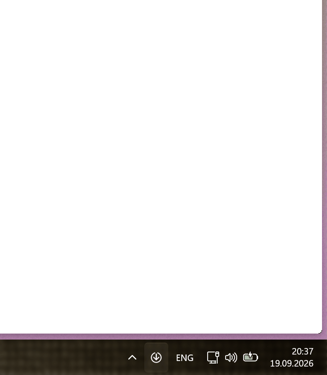
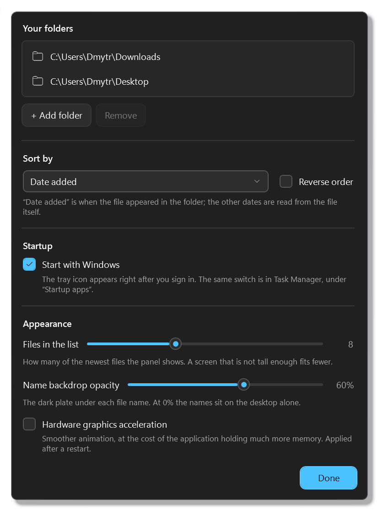
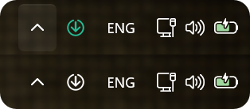

# Downloads Stack — a macOS Dock stack for the Windows tray

**An attempt to bring the macOS Dock's Downloads stack to Windows 11.** On a Mac, the Downloads folder sits
in the Dock and fans open into the newest files. Windows has no such thing, so this is it: an icon in the
system tray, next to the clock, that opens a compact list of the newest files from the folders you choose.

[](https://github.com/Vivoxti/Downloads-Stack-For-Windows-Tray/releases/latest)
[](https://github.com/Vivoxti/Downloads-Stack-For-Windows-Tray/releases)
[](https://github.com/Vivoxti/Downloads-Stack-For-Windows-Tray/actions/workflows/ci.yml)
[](LICENSE)

<p align="center">
  
</p>

Windows 11 · .NET 10 · WPF · a self-contained build, with nothing to install beforehand.

It is a list rather than a fan: no stack animation, no grid view, no Dock. What it borrows is the idea —
the newest downloads one click away, without opening File Explorer. The panel is fully transparent, so all
you see are the system file icons and the file names. One click opens a file, dragging hands over a real
Shell data object, a right click brings up the classic File Explorer context menu. There can be several
source folders; Downloads is connected by default.

## Install

Ready-made builds live on the [releases page](https://github.com/Vivoxti/Downloads-Stack-For-Windows-Tray/releases/latest). Both packages carry the same application — the only choice is how it gets onto the machine.

| Package | File | What it does |
| --- | --- | --- |
| Installer | `DownloadsStack-<version>-win-x64.msi` | An ordinary wizard — welcome, licence, where to put it, install — for all users, into `C:\Program Files\Downloads Stack`. One UAC prompt. The folder can be changed, and whichever folder is picked gets a `Downloads Stack` subfolder inside it. Adds a Start menu shortcut, launches the application when it finishes, and is removed through Installed apps. |
| Portable | `DownloadsStack-<version>-portable-win-x64.zip` | One executable inside. Unpack it anywhere and run `Downloads Stack.exe`. Nothing appears anywhere in the system until you turn on startup yourself. |

The application is not signed with a certificate, so SmartScreen will warn you on the first run: More info → Run anyway.

If you want it without administrator rights, take the portable build: one executable, and nothing written outside the folder it sits in.

Starting with Windows works the same way in both packages — a checkbox in the settings; see the section below.

## Running it

Run `Downloads Stack.exe` — from the installed folder, from the unpacked archive, or from `artifacts/win-x64` after a local build. No window appears on the first run: the application lives in the tray. If Windows put the icon under the hidden-icons arrow, drag it out next to the clock. Pinning it to the main taskbar is not required.

- Left click on the icon shows and hides the list.
- Escape, Alt+F4 and a click outside hide the list and leave the application running.
- Right click on the icon opens the list, the folder settings and Exit.
- Running the EXE again opens the list of the instance that is already running.
- `--show` opens the panel immediately on the first run (useful for checking).
- `--quit`, `--autostart-on`, `--autostart-off` are windowless commands: stop the running instance, turn startup on and off. See "Starting with Windows".
- Exit in the menu ends the process completely and removes the icon.

Before you start a new build, close the previous instance through Exit. Otherwise running it again just activates the version that is already there.

## The list and its settings

No title, no buttons, no scrolling: the newest files that fit, the newest at the bottom. A left click or Enter opens one, a right click gives the real Windows Shell menu, and dragging hands the file to whatever accepts it. Each name carries its own dark backdrop so it stays readable over any wallpaper, and PNG, JPG and MP4 show the system thumbnail instead of a generic icon.

<p align="center">
  
</p>

A right click on the tray icon opens the settings — folders, sort order, how many files, backdrop opacity, startup, hardware acceleration — and everything but the last applies at once. Settings and index live in `%LOCALAPPDATA%\DownloadsStack`.

The tray icon is white while the list is closed and green while it is open.

<p align="center">
  
</p>

## Starting with Windows

A "Start with Windows" checkbox in the settings, which writes the executable's path into `HKCU\Software\Microsoft\Windows\CurrentVersion\Run` — no administrator rights, no service, no scheduled task, and the same switch turns up in Task Manager's Startup apps, where turning it off wins.

## Building

Windows 11 and the .NET SDK 10 are required. The self-contained build includes the runtime.

```powershell
dotnet test -c Release
dotnet publish src/DownloadsStack/DownloadsStack.csproj -c Release -r win-x64 --self-contained true -p:PublishTrimmed=false -o artifacts/win-x64
```

Publish runs crossgen (`PublishReadyToRun`), so it takes noticeably longer than an ordinary build; at application startup that saves most of the JIT work. WinForms is not used: the tray icon is registered through `Shell_NotifyIcon` directly.

`scripts/package.ps1` builds the two release packages — the single-executable archive and the installer — running the tests first, which `-SkipTests` skips.

The installer is built by WiX 6, wired up as a local tool of the repository: `dotnet tool restore` is its entire toolchain, and `package.ps1` does that itself. The package markup is `packaging/DownloadsStack.wxs`. The version number lives in one place, in `<Version>` in `src/DownloadsStack/DownloadsStack.csproj`: both the archive name and the installer's upgrade logic read it from there.

`Theme.xaml` holds the shared styles. `TrayService` is the tray icon. `MainWindow` covers opening and closing, positioning and dragging. `DownloadsService` watches the folders. `ShellService` performs the Windows file operations.

The checks and the limitations are in `CHECKS.md`. `scripts/smoke-lifecycle.ps1` was rewritten for tray mode: start without a window, delivery of a real click on the icon after re-registering with the shell, opening the list from a second launch, closing back into the tray, a single instance, the shortcut with its AppUserModel.ID, and no entries in `app.log` over the run. It also checks the installer's commands: that `--quit` really stops the process, that `--autostart-on` writes the expected line into `Run`, and that `--autostart-off` removes it. Whatever way the run ends, the script puts that line's previous value on the machine back.
